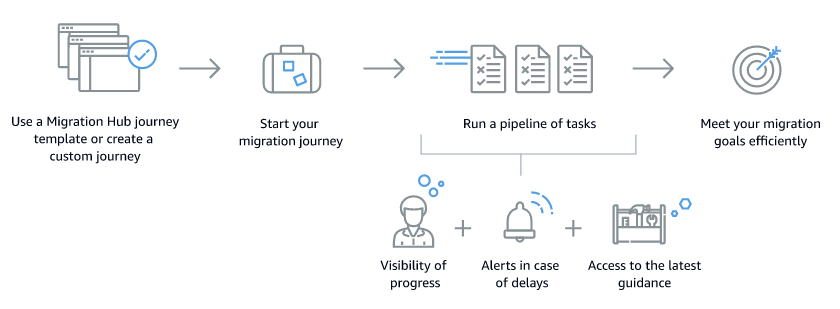

# What is AWS MigOps?

AWS MigOps is an [AWS Migration Hub](https://aws.amazon.com/migration-hub/) service that you can use to plan, perform, and track migrations into AWS\. AWS MigOps combines the tools that are available in AWS Migration Hub with the latest guidance from [AWS Prescriptive Guidance](https://aws.amazon.com/prescriptive-guidance), documentation, and other sources\. You don't need an AWS account to use AWS MigOps\.

The core concept in AWS MigOps is the migration journey, which is a pipeline of migration\-related tasks that you can assign to different teams or individuals\. You can create a journey from scratch or from one of the templates that AWS MigOps provides\. These templates represent common migration scenarios and follow best practices\. If you create your journey from a template, you can customize the journey to better match your particular scenario\. The following diagram provides an overview of how AWS MigOps works\. 

## Setting up for AWS MigOps

To access the [AWS MigOps console](https://prod.us-east-2.console.migops.migration-services.aws.dev/), you need to have an [AWS Builder ID](https://docs.aws.amazon.com/general/latest/gr/aws_builder_id.html).

AWS MigOps doesn't currently support requesting or deleting your data through the process described in [Privacy and data in AWS Builder ID](https://docs.aws.amazon.com/general/latest/gr/privacy-aws_builder_id.html). To request or delete your AWS MigOps data, contact your AWS representative.

Amazon employees don't need an AWS Builder ID and can instead use Midway authentication to access the AWS MigOps console.

## Are you a first\-time AWS MigOps user?

If you are a first\-time user of AWS MigOps, we recommend that you begin by reading the following sections:
+ [Migration journeys](migration-journeys.md)
+ [Migration templates](migration-templates.md)
+ [Migration spaces](migration-spaces.md)
+ [Tutorials](tutorials.md)
